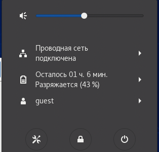
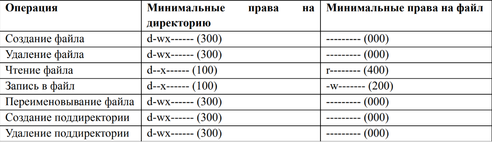

---
## Front matter
lang: ru-RU
title: Лабораторная работа №2
author: |
	Kirill V. Didus\inst{1}
institute: |
	\inst{1}RUDN University, Moscow, Russian Federation
date: RUDN University, 18 September, 2021 Moscow, Russia

## Formatting
toc: false
slide_level: 2
theme: metropolis
header-includes: 
 - \metroset{progressbar=frametitle,sectionpage=progressbar,numbering=fraction}
 - '\makeatletter'
 - '\beamer@ignorenonframefalse'
 - '\makeatother'
aspectratio: 43
section-titles: true
---

# Прагматика выполнения лабораторной работы 

## Прагматика выполнения лабораторной работы 

- Основы работы с пользователями в ОС Linux.

- Основы разграничения прав файлов и директорий.

# Цель выполнения лабораторной работы

## Цель выполнения лабораторной работы

- Получение практических навыков работы в консоли с атрибутами файлов

- Закрепление теоретических основ дискреционного разграничения доступа в современных системах с открытым кодом на базе ОС Linux.

# Задачи выполнения лабораторной работы

## Задачи выполнения лабораторной работы

- Создать нового пользователя

- Научиться работать с атрибутами файлов и директорий

# Результаты выполнения лабораторной работы

## Создание нового пользователя

\centering

{ width=70% }

## Минимальные права

\centering

{ width=70% }

## {.standout}
Вывод:
 
- Получил практические навыки работы в консоли с атрибутами файлов
- Закрепил теоретические основы дискреционного разграничения доступа в современных системах с открытым кодом на базе ОС Linux.