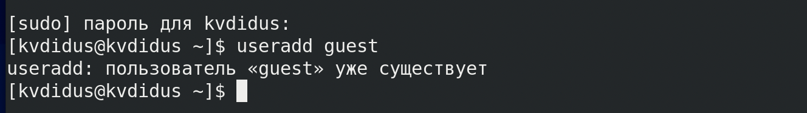
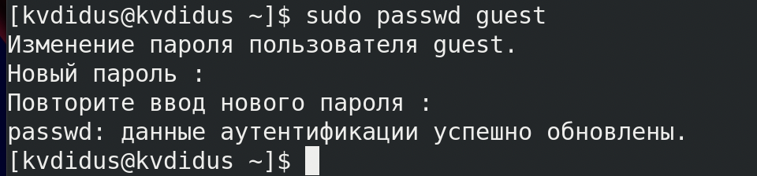
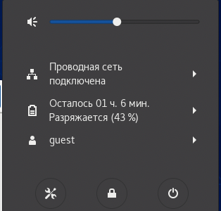
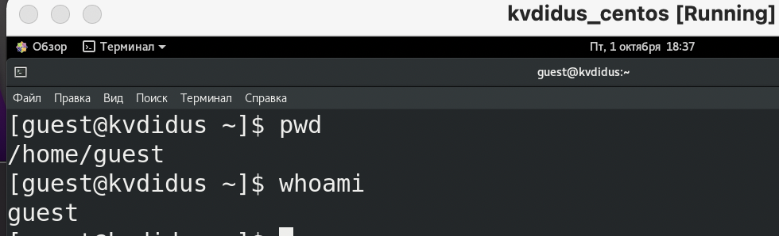
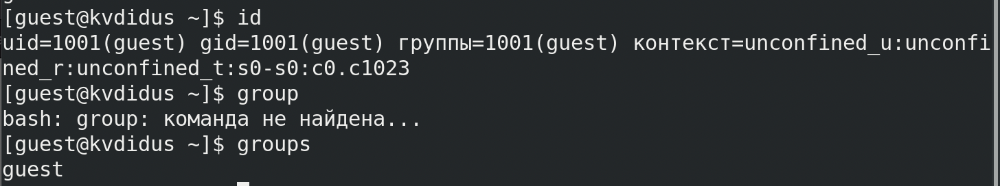
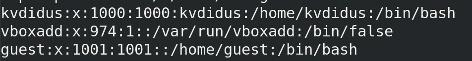
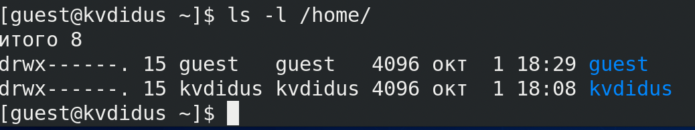
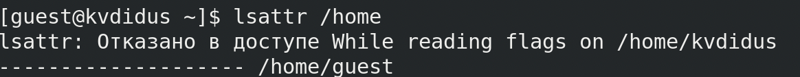
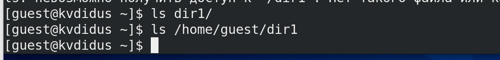

---
# Front matter
lang: ru-RU
title: "Лабораторная работа №2"
subtitle: "Информационная безопасность"
author: "Дидусь Кирилл Валерьевич"

# Formatting
toc-title: "Содержание"
toc: true # Table of contents
toc_depth: 2
lof: true # List of figures
lot: true # List of tables
fontsize: 12pt
linestretch: 1.5
papersize: a4paper
documentclass: scrreprt
polyglossia-lang: russian
polyglossia-otherlangs: english
mainfont: PT Serif
romanfont: PT Serif
sansfont: PT Sans
monofont: PT Mono
mainfontoptions: Ligatures=TeX
romanfontoptions: Ligatures=TeX
sansfontoptions: Ligatures=TeX,Scale=MatchLowercase
monofontoptions: Scale=MatchLowercase
indent: true
pdf-engine: lualatex
header-includes:
  - \linepenalty=10 # the penalty added to the badness of each line within a paragraph (no associated penalty node) Increasing the value makes tex try to have fewer lines in the paragraph.
  - \interlinepenalty=0 # value of the penalty (node) added after each line of a paragraph.
  - \hyphenpenalty=50 # the penalty for line breaking at an automatically inserted hyphen
  - \exhyphenpenalty=50 # the penalty for line breaking at an explicit hyphen
  - \binoppenalty=700 # the penalty for breaking a line at a binary operator
  - \relpenalty=500 # the penalty for breaking a line at a relation
  - \clubpenalty=150 # extra penalty for breaking after first line of a paragraph
  - \widowpenalty=150 # extra penalty for breaking before last line of a paragraph
  - \displaywidowpenalty=50 # extra penalty for breaking before last line before a display math
  - \brokenpenalty=100 # extra penalty for page breaking after a hyphenated line
  - \predisplaypenalty=10000 # penalty for breaking before a display
  - \postdisplaypenalty=0 # penalty for breaking after a display
  - \floatingpenalty = 20000 # penalty for splitting an insertion (can only be split footnote in standard LaTeX)
  - \raggedbottom # or \flushbottom
  - \usepackage{float} # keep figures where there are in the text
  - \floatplacement{figure}{H} # keep figures where there are in the text
---

# Цель работы

Получение практических навыков работы в консоли с атрибутами фаи- лов, закрепление теоретических основ дискреционного разграничения доступа в современных системах с открытым кодом на базе ОС Linux1.

# Задание

1. Создать нового пользователя (гостя)
2. Научиться работать с атрибутами фаилов и директории

# Выполнение лабораторнои работы

 1. Создал новую учетную запись пользователя командои ```useradd guest``` (рис. -@fig:001)

{ #fig:001 width=70% }

 2. Задал пароль для этои учетнои записи командои ```passwd guest``` (рис. -@fig:002)

{ #fig:002 width=70% }

 3. Вошел в систему под профилем guest (рис. -@fig:003)

{ #fig:003 width=70% }

 4. Проверил адрес домашнеи директории и имя рабочего профиля (рис. -@fig:004)

{ #fig:004width=70% }
 
 5. Открыл фаил /etc/passwd и нашел в нем uid и gid для пользователя guest. Они совпали с выводом команды ```id``` (рис. -@fig:005)

{ #fig:005 width=70% }

Данные файла (рис. -@fig:006)

{ #fig:006 width=70% }

 6. Командои ```ls -l /home/``` вывел содержимое папки /home и прочитал права доступа. Для директории разрешены чтение, запись и запуск (рис. -@fig:007)

{ #fig:007 width=70% }

 7. При выполнении команды ```lsattr /home```  для вывода расширенных атрибутов директории получил отказ. 
 
 8. Командои ```ls -l``` проверил права доступа к новои папке dir1. Для владельца rwx, для группы - rwx, для остальных - r-x. Нам удалось увидеть расширенные атрибуты директории, но не удалось увидеть расширенные атрибуты директории других
пользователеи. (рис. -@fig:008)

{ #fig:008 width=70% }

 9. Сбросил права доступа для папки dir1 командои ```chmod 000 dir1```. После, попытался создать фаил file1 в папке dir1 командои ```echo "test" > директория``` и получил отказ в доступе. Проверив содержимое папки dir1, убедился что она деиствительно пуста. (рис. -@fig:009)

{ #fig:009 width=70% }
 
# Заполнение таблицы 2.1 - "Установленные права и разрешенные деиствия"

#  Заполнение таблицы 2.2  - "Минимальные права для совершения операции"
 
# Выводы

Получил практические навыки работы в консоли с атрибутами фаилов, закрепил теоретические основы дискреционного разграничения доступа в современных системах с открытым кодом на базе ОС Linux.

