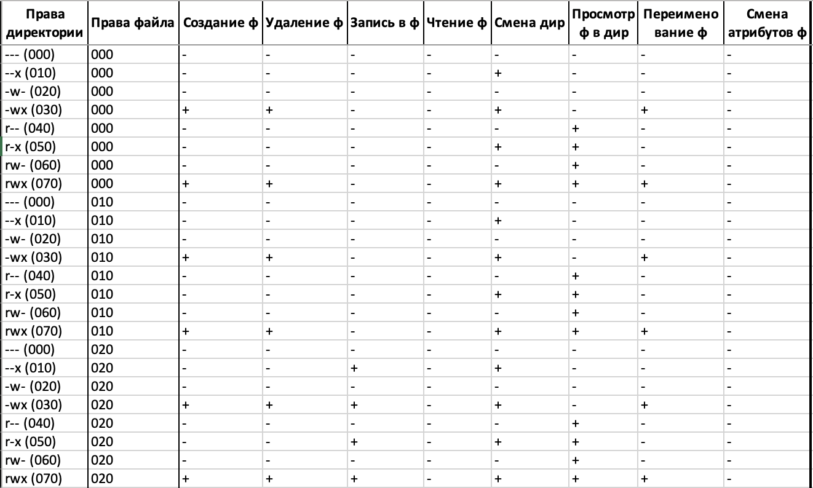
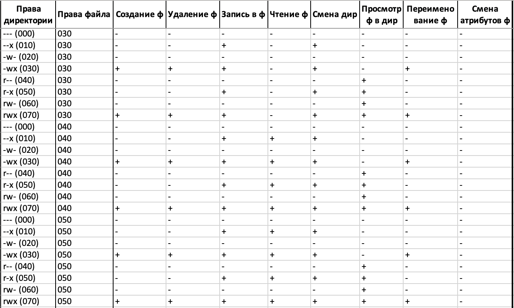
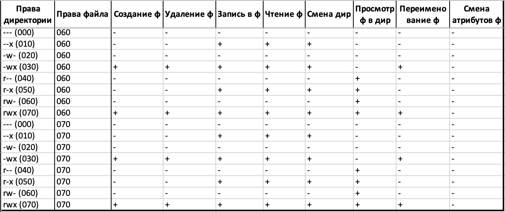

---
# Front matter
lang: ru-RU
title: "Лабораторная работа №3"
subtitle: "Информационная безопасность"
author: "Дидусь Кирилл Валерьевич"

# Formatting
toc-title: "Содержание"
toc: true # Table of contents
toc_depth: 2
lof: true # List of figures
lot: true # List of tables
fontsize: 12pt
linestretch: 1.5
papersize: a4paper
documentclass: scrreprt
polyglossia-lang: russian
polyglossia-otherlangs: english
mainfont: PT Serif
romanfont: PT Serif
sansfont: PT Sans
monofont: PT Mono
mainfontoptions: Ligatures=TeX
romanfontoptions: Ligatures=TeX
sansfontoptions: Ligatures=TeX,Scale=MatchLowercase
monofontoptions: Scale=MatchLowercase
indent: true
pdf-engine: lualatex
header-includes:
  - \linepenalty=10 # the penalty added to the badness of each line within a paragraph (no associated penalty node) Increasing the value makes tex try to have fewer lines in the paragraph.
  - \interlinepenalty=0 # value of the penalty (node) added after each line of a paragraph.
  - \hyphenpenalty=50 # the penalty for line breaking at an automatically inserted hyphen
  - \exhyphenpenalty=50 # the penalty for line breaking at an explicit hyphen
  - \binoppenalty=700 # the penalty for breaking a line at a binary operator
  - \relpenalty=500 # the penalty for breaking a line at a relation
  - \clubpenalty=150 # extra penalty for breaking after first line of a paragraph
  - \widowpenalty=150 # extra penalty for breaking before last line of a paragraph
  - \displaywidowpenalty=50 # extra penalty for breaking before last line before a display math
  - \brokenpenalty=100 # extra penalty for page breaking after a hyphenated line
  - \predisplaypenalty=10000 # penalty for breaking before a display
  - \postdisplaypenalty=0 # penalty for breaking after a display
  - \floatingpenalty = 20000 # penalty for splitting an insertion (can only be split footnote in standard LaTeX)
  - \raggedbottom # or \flushbottom
  - \usepackage{float} # keep figures where there are in the text
  - \floatplacement{figure}{H} # keep figures where there are in the text
---

# Цель работы

Получение практических навыков работы в консоли с атрибутами фаилов для групп пользователеи.

# Выполнение лабораторнои работы

1. В установленнои операционнои системе создал учетную запись пользователя guest (использую учетную запись администратора): **useradd guest**
2. Задал пароль для пользователя guest (использую учетную запись администратора): **passwd guest**
3. Аналогично создал второго пользователя guest2.
4. Добавил пользователя guest2 в группу guest: **gpasswd -a guest2 guest**
5. Осуществил вход в систему от двух пользователеи на двух разных консолях: guest на первои консоли и guest2 на второи консоли.
6. Для обоих пользователеи командои pwd определил директорию, в которои вы находитесь. Это '/home/kvdidus'. Сравнил ее с приглашениями команднои строки. В них указывается активныи пользователь, но мы работаем в папке супер-юзера. 
7. Уточнил имя пользователя, его группу, кто входит в нее и к каким группам принадлежит он сам.  Определил командами **groups guest** и **groups guest2**, что пользователи guest и guest2 входят в одну группу guest. Сравнил вывод команды groups с выводом команд **id -Gn** и **id -G**. Эти команды вывели правильныи id и названия пользователеи и групп, к которым они принадлежат.
8. Сравнил полученную информацию с содержимым фаила /etc/group, просмотрев содержимое фаила командои **cat /etc/group**: данные совпали.
9. От имени пользователя guest2 выполнил регистрацию пользователя guest2 в группе guest командои **newgrp guest**
10. От имени пользователя guest изменил права директории /home/guest, разрешив все деиствия для пользователеи группы командои: **chmod g+rwx /home/guest**
11. От имени пользователя guest снял с директории /home/guest/dir1 все атрибуты командои: **chmod 000 dir0** и проверил правильность снятия атрибутов. 

## Заполнение таблицы прав группы
Меняя атрибуты у директории dir1 и фаила file1 от имени пользователя guest и проверяя изменения от пользователя guest2, заполнил таблицу "права группы", определив опытным путем, какие операции разрешены, а какие нет. Если операция разрешена, заносил в таблицу знак «+», если не разрешена, знак «-».

Сравнил табл. 2.1 ("права пользователя") и табл. 3.1. ("права группы").
На основании заполненнои таблицы определил те или иные минимально необходимые права для выполнения пользователем guest2 операции внутри директории dir1 и заполнил табл. 3.2. "минимальные права группы"

## Таблица "Установленные права и разрешенные деиствия для групп"

"Установленные права и разрешенные деиствия для групп". (рис. -@fig:001)

{ #fig:001 width=95% }
{ #fig:002 width=95% }
{ #fig:003 width=95% }

## Таблица "Минимальные права для совершения операции от имени пользователеи входящих в группу"

 "Минимальные права для совершения операции от имени пользователеи входящих в группу". (рис. -@fig:004)
 
{ #fig:004 width=95% }

# Выводы
Рассмотрел разрешенные деиствия при установке различных прав доступа для групп.