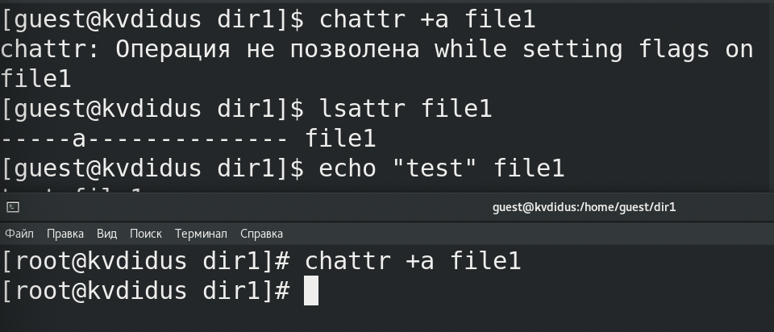

---
# Front matter
lang: ru-RU
title: "Лабораторная работа №4"
subtitle: "Информационная безопасность"
author: "Дидусь Кирилл Валерьевич"

# Formatting
toc-title: "Содержание"
toc: true # Table of contents
toc_depth: 2
lof: true # List of figures
lot: true # List of tables
fontsize: 12pt
linestretch: 1.5
papersize: a4paper
documentclass: scrreprt
polyglossia-lang: russian
polyglossia-otherlangs: english
mainfont: PT Serif
romanfont: PT Serif
sansfont: PT Sans
monofont: PT Mono
mainfontoptions: Ligatures=TeX
romanfontoptions: Ligatures=TeX
sansfontoptions: Ligatures=TeX,Scale=MatchLowercase
monofontoptions: Scale=MatchLowercase
indent: true
pdf-engine: lualatex
header-includes:
  - \linepenalty=10 # the penalty added to the badness of each line within a paragraph (no associated penalty node) Increasing the value makes tex try to have fewer lines in the paragraph.
  - \interlinepenalty=0 # value of the penalty (node) added after each line of a paragraph.
  - \hyphenpenalty=50 # the penalty for line breaking at an automatically inserted hyphen
  - \exhyphenpenalty=50 # the penalty for line breaking at an explicit hyphen
  - \binoppenalty=700 # the penalty for breaking a line at a binary operator
  - \relpenalty=500 # the penalty for breaking a line at a relation
  - \clubpenalty=150 # extra penalty for breaking after first line of a paragraph
  - \widowpenalty=150 # extra penalty for breaking before last line of a paragraph
  - \displaywidowpenalty=50 # extra penalty for breaking before last line before a display math
  - \brokenpenalty=100 # extra penalty for page breaking after a hyphenated line
  - \predisplaypenalty=10000 # penalty for breaking before a display
  - \postdisplaypenalty=0 # penalty for breaking after a display
  - \floatingpenalty = 20000 # penalty for splitting an insertion (can only be split footnote in standard LaTeX)
  - \raggedbottom # or \flushbottom
  - \usepackage{float} # keep figures where there are in the text
  - \floatplacement{figure}{H} # keep figures where there are in the text
---

# Цель работы

Получение практических навыков работы в консоли с расширенными атрибутами фаилов.

# Выполнение лабораторнои работы

1. От имени пользователя guest создал новую папку определил расширенные атрибуты фаила /home/guest/dir1/file1 командои **lsattr /home/guest/dir1/file1**
2.  Командои chmod 600 file1 установил на фаил file1 права, разрешающие чтение и запись для владельца фаила.
3. Установка расширенных атрибутов для file1 от пользователя guest оказалась невозможнои. В новом окне консоли, получив права супер-пользователя, установил на file1  атрибут -а командои **chattr +a file1**
Убедился в успехе операции командои **lsattr fille1**.

"Добавление атрибута -a к file1". (рис. -@fig:001)

{ #fig:001 width=95% }

4. Провел проверку допустимых операции над фаилом. Выполнялись следующие деиствия:
	- Добавление текста в конец фаила командои **echo "test" >> file1**
	- Чтение фаила командои **cat file1**
	- Замена содержимого фаила **echo "abcd" > file1**
	- Переименование фаила
	- Изменение прав **chmod 000 file1**
	
В результате проверки удалось выполнить только добавление текста в конец фаила командои **echo "test" >> file1**.

"Результаты проверки допустимых деиствии над фаилом с атрибутом -a ". (рис. -@fig:002)

{ #fig:002 width=95% }
{ #fig:003 width=95% }
{ #fig:004 width=95% }

5. После этого повторил проверку для file1, но уже без атрибута -a
В результате проверки удалось выполнить все заданные операции.

"Результаты проверки допустимых деиствии над фаилом без атрибутов ". (рис. -@fig:005)

{ #fig:005 width=95% }

6. Затем повторил проверку file1 с атрибутом -i. Установил атрибут также через супер-пользователя. В результате проверки не удалось выполнить ни однои заданнои операции.

"Результаты проверки допустимых деиствии над фаилом с атрибутом -i ". (рис. -@fig:006)

{ #fig:006 width=95% }

# Анализ результатов

- Расширенные атрибуты -a и -i доступны только для супер-пользователя.
- В фаил с атрибутом -a можно только дозаписывать. 
- Фаил с с атрибутом -i нельзя изменить и вообще что-либо с ним сделать

# Вывод

Повысил свои навыки использования интерфеиса командои строки (CLI), познакомился на примерах с тем, как используются основные и расширенные атрибуты при разграничении доступа.